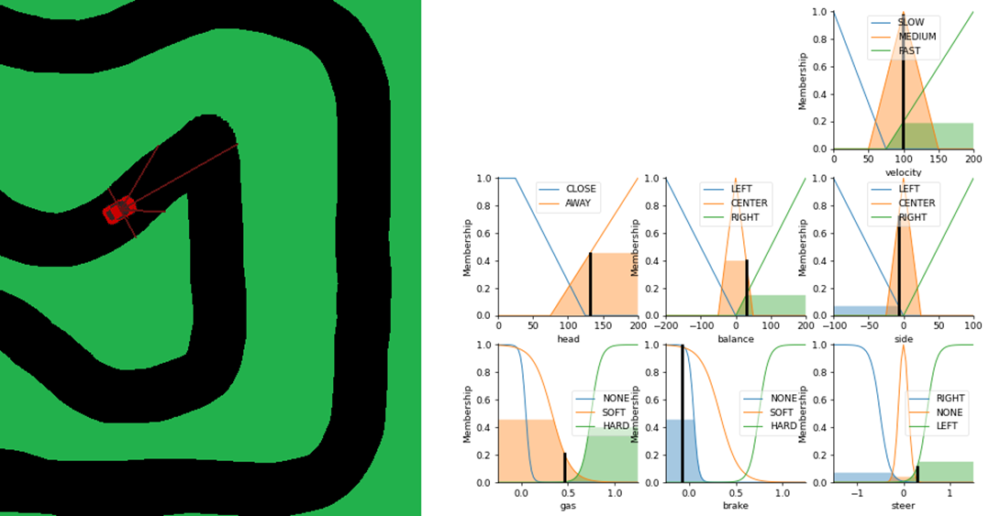

# Fuzzy logic racing car

The project tries to apply fuzzy logic to control car in simple racing game.

### Controls

+ <kbd>C</kbd> – switch the vehicle controller between the keyboard (user) and the fuzzy controller.
+ <kbd>P</kbd> – pause the controller.
+ <kbd>S</kbd> – execute of one simulation step during pause (1 frame assuming 30 frames per second). At each step, the state of the fuzzy controller is also written to the output (console).
+ <kbd>V</kbd> – toggle drawing graphs to illustrate the operation of controller rules.
+ <kbd>Q</kbd> – exit from the program.
+ Arrows (<kbd>↑</kbd><kbd>↓</kbd><kbd>→</kbd><kbd>←</kbd>) and spacebar (<kbd> </kbd>) – vehicle control when the keyboard controller is active.

### To-do

+ Faster updating visualization - might be possible, but requires a lot of work:
	+ Try update plot instead full redo, see:
		+ https://stackoverflow.com/questions/4098131/how-to-update-a-plot-in-matplotlib
		+ https://stackoverflow.com/questions/16120801/matplotlib-animate-fill-between-shape
	+ Current solution: `matplotlib.backends.backend_agg`, and drawing into pygame RGBA buffer
	+ `pygame-matplotlib` backend seems to yield no improvement - https://github.com/lionel42/pygame-matplotlib-backend/issues/3
+ Track lap time to score model
